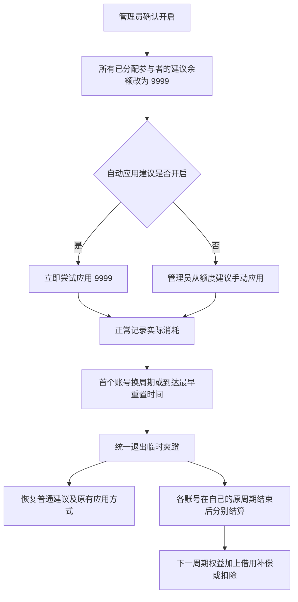
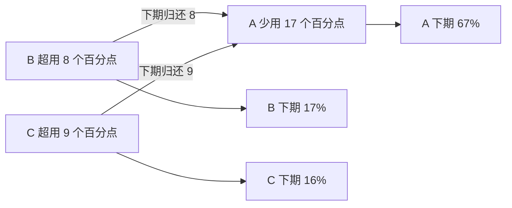
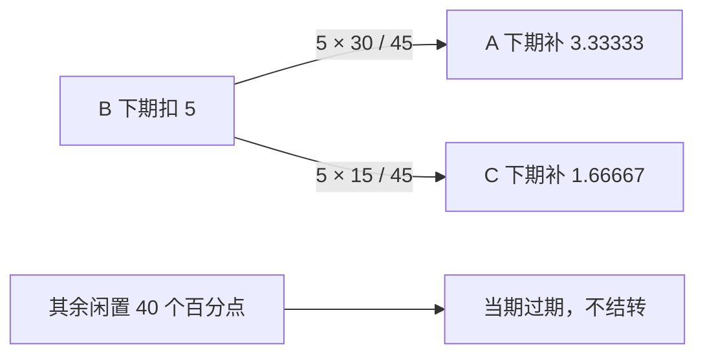

# 临时爽蹬模式

临时爽蹬用于**本期按需使用、下期归还借用权益**：把参与者的建议余额暂时统一设为 **9999 美元**，但继续记录真实消费和百分比权益。它不会增加订阅容量，也不会永久修改合同分配比例。

应用内入口：**额度总览 → 当前额度建议下方 → 临时爽蹬**。教程入口：**使用教程 → 日常使用 → 临时爽蹬**，提供可切换例子的图表。

## 开启与退出



1. 所有启用的 Sub2API 账号需有当前周期的新鲜有效观测和完整参与者归属。
2. 管理员点击“开启临时爽蹬”，确认全局影响。
3. 已开启自动应用时，系统立即尝试写入余额，并显示成功、失败人数；未开启时只改变建议，需要手动应用。
4. 模式到期后，**不再统一建议 9999**。自动应用仍按原开关运行；未开启自动应用时，需要手动应用新建议，收回上游高余额。
5. 上一轮还有原周期待结算时不能再次开启；刷新、重启不会丢失模式或结算记录。

> 9999 是钱包余额，不是 9999% 权益。上游限速、模型权限和套餐总量限制仍然有效；放开余额后，个别人可能迅速耗尽全组订阅额度。

## 结算规则

以**百分点**记账，不把不同模型的美元成本直接视为权益比例：

```text
本期可用权益 = 固定合同权益 + 上期结转调整
未用份额 = max(本期可用权益 − 本期实际归属, 0)
超用份额 = max(本期实际归属 − 本期可用权益, 0)
实际借用总额 = min(总未用份额, 总超用份额)
```

- 借用总额按各人的**未用份额比例**补偿给让出权益的人。
- 同一总额按各人的**超用份额比例**从超用者下一期权益扣除。
- 补偿与扣除合计为零；没有被借用的闲置份额到期作废，不凭空增加下一期权益。
- 未分配或无法归属的剩余容量不虚构成某人的借出份额。
- 内部以 5 位小数的百分点结算，界面显示 2 位；舍入余数确定性分配，保证账本加减严格相等。
- 合同份额和真实消耗记录保持不变，调整作为独立的周期记录参与普通余额建议计算。

## 示例一：整轮额度用满

合同为 A 50%、B 25%、C 25%，实际使用 33%、33%、34%。



| 参与者 | 合同权益 | 实际使用 | 下期调整 | 下期可用权益 |
| --- | ---: | ---: | ---: | ---: |
| A | 50% | 33% | +17 个百分点 | 67% |
| B | 25% | 33% | −8 个百分点 | 17% |
| C | 25% | 34% | −9 个百分点 | 16% |

## 示例二：B 超用 5 个百分点，A、C 都剩很多

| 参与者 | 合同权益 | 实际使用 | 未用份额／超用 |
| --- | ---: | ---: | ---: |
| A | 50% | 20% | 未用 30 个百分点 |
| B | 25% | 30% | 超用 5 个百分点 |
| C | 25% | 10% | 未用 15 个百分点 |

A、C 让出份额之比是 `30 : 15 = 2 : 1`，只分配 B 借用的 5 个百分点：



下一周期显示 **A 53.33%、B 20%、C 26.67%**。不是把所有未用份额都结转成 A 80%、C 40%。

## 示例三：没有人超用

- A 用 50%、B 用 15%、C 用 10%：A 只是用满自己的份额，并未借用他人权益。
- A 用 30%、B 用 20%、C 用 20%：所有人都没用满。

两种情况在没有旧结转的前提下，下一期均保持 **50% / 25% / 25%**。用得比别人多不等于欠账，超出本期可用权益才算借用。

## 再下个周期怎么办

固定合同始终是 50% / 25% / 25%，不是永久改成 67% / 17% / 16%。第二期按**调整后的本期权益**结算：

| 第二期实际使用 | 第二期末新的借用调整 | 第三期可用权益 |
| --- | --- | --- |
| 67% / 17% / 16% | 0 / 0 / 0 | 50% / 25% / 25% |
| 50% / 25% / 25% | +17 / −8 / −9 | 67% / 17% / 16% |
| 60% / 20% / 20% | +7 / −3 / −4 | 57% / 22% / 21% |

若没有人超出第二期调整后的权益，就不产生新的借用；未使用且未被借用的额度到期作废，不不断积累为无限权益。

## 多账号与观测边界

- **全局开启、首个换周期退出**。同一个参与者在 Sub2API 只有一个全局钱包，因此不能假装 9999 只影响首页选中的账号。
- 覆盖所有启用的 Sub2API 账号及其已分配参与者，CPA 不参与。
- 账号重置时间不同：首个账号确认换周期时统一退出，较晚账号在自己的原周期结束时再结算。它们不会让已经进入新周期的账号继续无限使用。
- 每个账号独立按自己的周期和百分点结算，按现有容量、实际扣费换算后汇入全局余额建议；不同账号百分点不直接相加结算。
- 本期合同与参与者绑定在开启时冻结；结算覆盖该官方周期已保留的有效归属数据，不仅计算开启后的消费。
- 价格时期变化和人工测算起点不等于订阅换周期；同一官方周期的多个测算段合并计入消耗，同一段只取最后有效累计值，避免重复记账。
- 结算依据是旧周期保留的最后有效观测，卡片显示证据时间；不伪造未采样尾部消费。
- 缺失参与者证据、有未结清权益的参与者被移除或换绑、跨过多个周期等情况，保留待结算错误，不静默丢失借用账。
- 暂停后台监控后，模式到期仍停止建议 9999，但自动采样、上游余额回收和结算不会凭空完成；需恢复监控或手动采样、应用并核对上游余额。

## 实现与验证

- `GET /api/dashboard/temporary-burst`：管理员读取全局状态、各账号周期与结算依据，不修改余额。
- `POST /api/dashboard/temporary-burst`，请求 `{"confirm": true}`：管理员明确开启。无确认、无有效账号或缺少必要观测会拒绝。
- 迁移 `0057_temporary_burst` 新建模式与周期账本，不联网，不自动开启。
- 手动与自动调额复用既有带租约、幂等对账的余额操作链路。
- `backend/monitor/tests/test_temporary_burst.py` 验证守恒、无超用、重复结算、多账号首个退出、跨测算段及余额恢复。
- `scripts/temporary_burst_browser_smoke.py` 使用全新合成数据库、真实 Django/Vue 和仅限本机的模拟上游验证，禁止连接真实业务环境。
